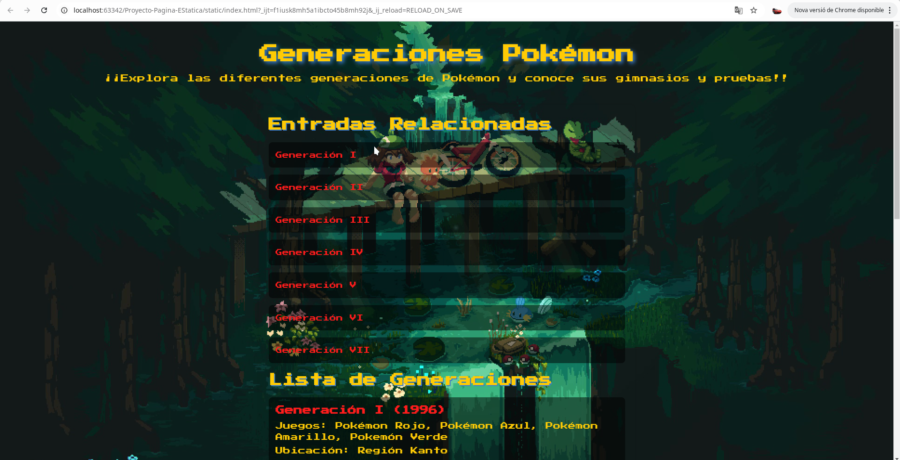
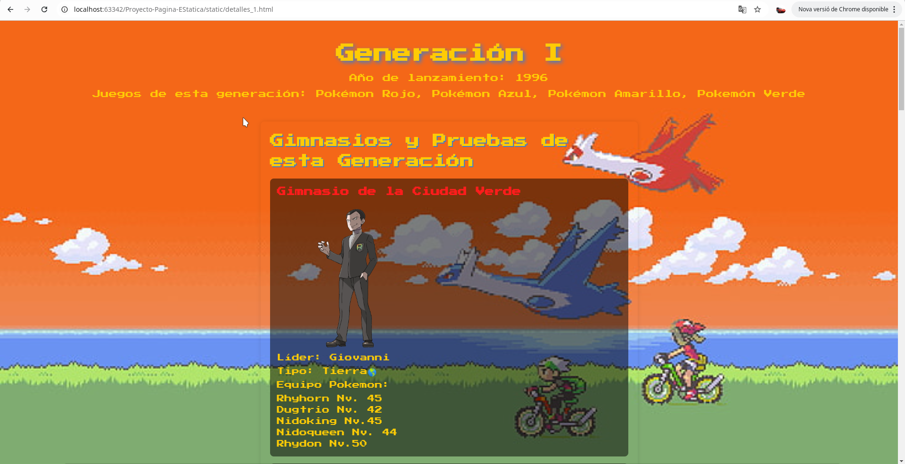

# Memòria del Proyecto

## Proyecto Generador de Web Estatica
### Curso: 2DAM
### Alumno: Daniel Gonzalez Rico

---

## Índex

1. [Descripción del proyecto](#descripción-del-proyecto)
2. [Ficheros de entrada](#ficheros-de-entrada)
    - [Archivo INI](#archivo-ini)
    - [Archivo JSON](#archivo-json)
    - [Archivo Schema](#archivo-json-schema)
3. [Descripción de librerías, clases y dependencias](#descripción-de-librerías-clases-y-dependencias)
4. [Descripción de las plantillas Thymeleaf](#descripción-de-las-plantillas-thymeleaf)
5. [Ficheros de salida](#ficheros-de-salida)
    - [Ficheros XML](#ficheros-xml)
    - [Capturas de las páginas creadas](#capturas-de-las-páginas-creadas)
6. [Problemas resueltos y no resueltos](#problemas-resueltos-y-no-resueltos)

---

## Descripción del proyecto
La finalidad del proyecto es hacer un proyecto en InteliJ que a partir de unas plantillas de Thymelife pueda generar unos archivos html para una pagina web estatica.

---

## Ficheros de entrada

### Archivo INI

**Exemple d'arxiu INI:**

```ini
nom=Generaciones Pokémon
descripcio=¡¡Explora las diferentes generaciones de Pokémon y conoce sus gimnasios y pruebas!!

```
### Archivo Json
Ejemplo de una parte del json:
```json
{
  "generacions": [
    {
      "id": 1,
      "nom": "Generación I",
      "any_lanzamiento": 1996,
      "jocs": [
        "Pokémon Rojo",
        "Pokémon Azul",
        "Pokémon Amarillo",
        "Pokemón Verde"
      ],
      "localitzacio": "Región Kanto",
      "gimnassos": [
        {
          "id": 1,
          "nom": "Gimnasio de la Ciudad Verde",
          "lider": "Giovanni",
          "fotoUrl": "imatges/Giovanni.jpg",
          "tipus": ["Tierra🌎"],
          "pokemons": [
            "Rhyhorn Nv. 45",
            "Dugtrio Nv. 42",
            "Nidoking Nv.45",
            "Nidoqueen Nv. 44",
            "Rhydon Nv.50"
          ]
        },
        {
          "id": 2,
          "nom": "Gimnasio de la Ciudad Plateada",
          "lider": "Brock",
          "fotoUrl": "imatges/Brock.jpg",
          "tipus": ["Roca🪨"],
          "pokemons": [
            "Geodude Nv.12",
            "Onix Nv.14"
          ]
        },
        {
          "id": 3,
          "nom": "Gimnasio de la Ciudad Celeste",
          "lider": "Misty",
          "fotoUrl": "imatges/Misty.jpg",
          "tipus": ["Agua💧"],
          "pokemons": [
            "Staryu Nv.18",
            "Starmie Nv.21"
          ]
        },
        {
          "id": 4,
          "nom": "Gimnasio de la Ciudad Carmin",
          "lider": "Teniente Surge",
          "fotoUrl": "imatges/Lt._Surge.jpg",
          "tipus": ["Eléctrico⚡"],
          "pokemons": [
            "Voltorb Nv.21",
            "Pikachu Nv.18",
            "Richu Nv.24"
          ]
        },
        {
          "id": 5,
          "nom": "Gimnasio de la Ciudad Azulona",
          "lider": "Erika",
          "fotoUrl": "imatges/Erika.jpg",
          "tipus": ["Planta🌿"],
          "pokemons": [
            "Victreebel Nv.29",
            "Tangela Nv.24",
            "Vileplume Nv.29"
          ]
        },
        {
          "id": 6,
          "nom": "Gimnasio de la Ciudad Fucsia",
          "lider": "Koga",
          "fotoUrl": "imatges/Koga.jpg",
          "tipus": ["Veneno🌸"],
          "pokemons": [
            "Koffing Nv.37",
            "Koffing Nv.37",
            "Muk Nv.39",
            "Weezing Nv.43"
          ]
        },
        {
          "id": 7,
          "nom": "Gimnasio de la Ciudad Azafrán",
          "lider": "Sabrina",
          "fotoUrl": "imatges/Sabrina.jpg",
          "tipus": ["Psíquico🌙"],
          "pokemons": [
            "Kadabra Nv.38",
            "Venomoth Nv.38",
            "Mr. Mime Nv.37",
            "Alakazam Nv.43"
          ]
        },
        {
          "id": 8,
          "nom": "Gimnasio de las Islas Espuma",
          "lider": "Blaine",
          "fotoUrl": "imatges/Blaine.jpg",
          "tipus": ["Fuego🔥"],
          "pokemons": [
            "Growlithe Nv.42",
            "Ponyta Nv.40",
            "Rapidash Nv.42",
            "Arcanine Nv.47"
          ]
        }
      ]
    },

```
### Archivo Json-schema:
```json
{
  "$schema": "http://json-schema.org/draft-07/schema#",
  "title": "Generated schema for Root",
  "type": "object",
  "properties": {
    "generacions": {
      "type": "array",
      "items": {
        "type": "object",
        "properties": {
          "id": {
            "type": "number"
          },
          "nom": {
            "type": "string"
          },
          "any_lanzamiento": {
            "type": "number"
          },
          "jocs": {
            "type": "array",
            "items": {
              "type": "string"
            }
          },
          "localitzacio": {
            "type": "string"
          },
          "gimnassos": {
            "type": "array",
            "items": {
              "type": "object",
              "properties": {
                "id": {
                  "type": "number"
                },
                "nom": {
                  "type": "string"
                },
                "lider": {
                  "type": "string"
                },
                "fotoUrl": {
                  "type": "string"
                },
                "tipus": {
                  "type": "array",
                  "items": {
                    "type": "string"
                  }
                },
                "pokemons": {
                  "type": "array",
                  "items": {
                    "type": "string"
                  }
                }
              },
              "required": [
                "id",
                "nom",
                "lider",
                "fotoUrl",
                "tipus",
                "pokemons"
              ]
            }
          }
        },
        "required": [
          "id",
          "nom",
          "any_lanzamiento",
          "jocs",
          "localitzacio",
          "gimnassos"
        ]
      }
    }
  },
  "required": [
    "generacions"
  ]
}
```
## Descripción de librerias, classes i dependèncias

### Librerias:
- **thymeleaf**: Esta libreia la he añadido para poder hacer las plantillas de los archivos html.
- **jackson-databind y jackson-core**: Las he añadido para hacer lo pojos en las clases.
- **slf4j-api**: Esta la añadi para quitar un error de la terminal.
- **json-schema-validator**: Esta sirve para validar json con el schema.
### Clases:
- **Pokemon.java**: Esta clase tiene un ArrayList de objetos de la clase generacion.
- **Generaciones.java**: Esta clase define cada generacion con sus atributos con un ArrayList de objetos de la clase gimnasios.
- **Gimnasios.java**: Esta clase define los gimnasios de cada generacion.
### Dependencias:
```
<dependencies>                                        
    <dependency>                                      
        <groupId>org.thymeleaf</groupId>              
        <artifactId>thymeleaf</artifactId>            
        <version>3.1.2.RELEASE</version>              
    </dependency>                                     
    <dependency>                                      
        <groupId>com.fasterxml.jackson.core</groupId> 
        <artifactId>jackson-databind</artifactId>     
        <version>2.18.1</version>                     
    </dependency>                                     
    <dependency>                                      
        <groupId>com.fasterxml.jackson.core</groupId> 
        <artifactId>jackson-core</artifactId>         
        <version>2.18.1</version>                     
    </dependency>                                     
    <dependency>                                      
        <groupId>org.slf4j</groupId>                  
        <artifactId>slf4j-api</artifactId>            
        <version>1.7.32</version>                     
    </dependency>                                     
    <dependency>                                      
        <groupId>ch.qos.logback</groupId>             
        <artifactId>logback-classic</artifactId>      
        <version>1.2.6</version>                      
    </dependency>                                     
    <dependency>                                      
        <groupId>com.github.java-json-tools</groupId> 
        <artifactId>json-schema-validator</artifactId>
        <version>2.2.14</version>                     
    </dependency>                                     
    <dependency>                                      
        <groupId>com.fasterxml.jackson.core</groupId> 
        <artifactId>jackson-databind</artifactId>     
        <version>2.18.1</version>                     
    </dependency>                                     
</dependencies>                                       
``` 
## Descripción de las plantillas Thymeleaf.

### Plantilla de el index.html
```
<!DOCTYPE html>
<html lang="es" xmlns:th="http://www.thymeleaf.org">
<head>
    <meta charset="UTF-8">
    <title>Página Principal - Generaciones Pokémon</title>
    <link href="https://fonts.googleapis.com/css2?family=Press+Start+2P&display=swap" rel="stylesheet">
    <link rel="stylesheet" href="css/Diseño.css">
</head>
<body>
<header>
    <h1 th:text="${nom}"></h1>
    <p th:text="${descripcio}"></p>
</header>

<main>
    <section>
        <h2>Entradas Relacionadas</h2>
        <ul>
            <li th:each="generacion : ${generacions}">
                <a th:href="@{'detalles_' + ${generacion.id} + '.html'}" th:text="${generacion.nom}"></a>
            </li>
        </ul>
        <h2>Lista de Generaciones</h2>
        <ul>
            <li th:each="generacion : ${generacions}">
                <h3 th:text="${generacion.nom + ' (' + generacion.any_lanzamiento + ')'}"></h3>
                <p>Juegos: <span th:text="${#strings.arrayJoin(generacion.jocs, ', ')}"></span></p>
                <p>Ubicación: <span th:text="${generacion.localitzacio}"></span></p>
                <a th:href="@{'detalles_' + ${generacion.id} + '.html'}">Ver detalles de gimnasios y pruebas</a>
            </li>
        </ul>
    </section>
</main>
</body>
</html>
```
### Plantilla de los detalles de cada generación.
```
<!DOCTYPE html>
<html lang="es" xmlns:th="http://www.thymeleaf.org">
<head>
    <meta charset="UTF-8">
    <title th:text="'Detalles de la ' + ${generacion.nom}"> </title>
    <link href="https://fonts.googleapis.com/css2?family=Press+Start+2P&display=swap" rel="stylesheet">
    <link rel="stylesheet" href="css/Diseño2.css">
</head>
<body>
<header>
    <h1 th:text="${generacion.nom}"></h1>
    <p>Año de lanzamiento: <span th:text="${generacion.any_lanzamiento}"></span></p>
    <p>Juegos de esta generación: <span th:text="${#strings.arrayJoin(generacion.jocs, ', ')}"></span></p>
</header>

<main>
    <section>
        <h2>Gimnasios y Pruebas de esta Generación</h2>
        <ul>
            <li th:each="gimnasio : ${generacion.gimnassos}">
                <h3 th:text="${gimnasio.nom}"></h3>
                
                <p>Líder: <span th:text="${gimnasio.lider}"></span></p>
                <p>Tipo: <span th:text="${#strings.arrayJoin(gimnasio.tipus, ', ')}"></span></p>
                <p>Equipo Pokemon:</p>
                <span th:each="pokemon : ${gimnasio.pokemons}">
                <span th:text="${pokemon}"></span><br>
                </span>
            </li>
        </ul>
    </section>

    <a href="index.html" class="button">Volver a la página principal</a>
</main>
</body>
</html>
```
## Ficheros de salida.

### - Fichero Rss.xml:
```
<?xml version="1.0" encoding="UTF-8"?>
<rss version="2.0">
<channel>
<title>Generaciones Pokémon</title>
<link>src/main/resources/static/index.html</link>
<description>¡¡Explora las diferentes generaciones de Pokémon y conoce sus gimnasios y pruebas!!</description>
<item>
<title>Generación I</title>
<link>src/main/resources/static/detalles_1.html</link>
<description>Región Kanto</description>
</item>
<item>
<title>Generación II</title>
<link>src/main/resources/static/detalles_2.html</link>
<description>Región Johto</description>
</item>
<item>
<title>Generación III</title>
<link>src/main/resources/static/detalles_3.html</link>
<description>Región Hoenn</description>
</item>
<item>
<title>Generación IV</title>
<link>src/main/resources/static/detalles_4.html</link>
<description>Región Sinnoh</description>
</item>
<item>
<title>Generación V</title>
<link>src/main/resources/static/detalles_5.html</link>
<description>Región Teselia</description>
</item>
<item>
<title>Generación VI</title>
<link>src/main/resources/static/detalles_6.html</link>
<description>Región Kalos</description>
</item>
<item>
<title>Generación VII</title>
<link>src/main/resources/static/detalles_7.html</link>
<description>Región Alola</description>
</item>
</channel>
</rss>
```

- ### Capturas de les pàginas creadas:
#### Captura de el index.html.

#### Captura de detalles_1.html de la primera generación:


## Problemas resueltos i no resueltos

### Problemas con validar el json con el json-schema.

Tuve un problema al intentar validar un JSON utilizando JSON Schema, utilizando una librería llamada json-validator, pero no lograba capturar correctamente el error de validación dentro del bloque catch. A continuación, te adjunto los fragmentos del código que utilicé.

```
 }catch (IOException | ProcessingException e){
            System.out.println("Error al validar el json schema con el json.");
        }
 }       
```


